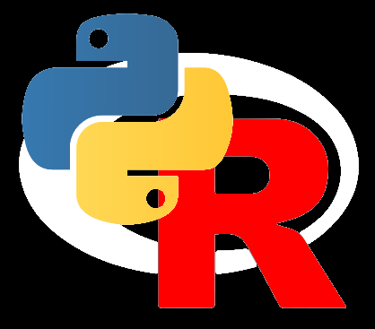

# PIPS_course
#### (Repository version 0.1.1)
Programming in Psychological Science course. This repository contains materials for an intro R + Python course

**Course Instructors: Michael Nunez and Hannes Rosenbusch from the University of Amsterdam**
**Based on course materials from Johnny van Doorn**

### Introduction

Dear future programmers, 

Welcome to Programming in Psychological Science! During this course, you will learn the basics of programming in R (and Python -- see below).

Programming is an important research skill and will benefit you greatly in your future career. Being able to program will allow you, for instance, to investigate human psychology though data simulation, make beautiful analyses and plots for your thesis, develop a web application for your start-up company, and develop practical statistical tools for the research and business community.

The use of R is rapidly increasing. Ask anyone in psychological research or data science! R is easy-to-learn, free, and platform-independent (http://cran.r-project.org). We will focus on R and provide knowledge of the most important concepts of programming in R and programming in general. You may choose to only learn R in this course with weekly R assignments, and an exam with only R questions.

But wait, there’s more! There will also an additional part of this course to learn the basics of another programming language, called Python (https://www.python.org/). Python is another easy-to-learn and free programming language. If you feel like learning R is exciting enough for now, you can choose to complete challenge R questions in weekly assignments instead of completing Python questions. However, we will do our best to show that using Python is easy when simultaneously learning R (and vice versa). So this course is a 2 for 1 deal!

### Objectives

At the end of this course, you will be able to (a) write small computer programs (e.g., make your own hangman game, or write your own t-test function), (b) run statistical analyses, (c) make plots to present their results, (d) run simulation studies, (e) analyze existing scripts to pinpoint and solve problems, (f) integrate existing functions into your own work, and (g) follow good programming practices! Furthermore, the course provides you with the basic programming skill-set that makes it easier to learn other programming languages such as C++ and Julia.

Concerning the Python part of the course, you will also learn to create interactive experiments and translate scientific task descriptions to programming code.

### Download & Installing

See the Downloading and Installing slides in downloading_installing/pips2022_downloading_installing.pdf

[R](https://cran.rstudio.com/)
[RStudio Desktop](https://www.rstudio.com/products/rstudio/download/#download)

Optional:
[Anaconda Python 3](https://www.anaconda.com/products/individual)
[PyCharm](https://www.jetbrains.com/pycharm/download)

### Lectures

Please watch the [YouTube lecture playlist](https://www.youtube.com/playlist?list=PLY3JDK9oD57jhyqr43dP4JuhiAUhZ9JB-).

The lecture series are organized into four Weeks, with 2 R lectures and 1 Python lecture per week. Note that some lectures mention the live course that was given for Masters students in early 2022. Lecture slides and scripts are available within this repository organized by Week.

Week 1:
[R Introduction 1](https://www.youtube.com/watch?v=N9Khyo9bdPk&list=PLY3JDK9oD57jhyqr43dP4JuhiAUhZ9JB-&index=1)
[R Introduction 2](https://www.youtube.com/watch?v=Xl0uQZv4hQI&list=PLY3JDK9oD57jhyqr43dP4JuhiAUhZ9JB-&index=2)
[Python Introduction](https://www.youtube.com/watch?v=5U4WovYcgjE&list=PLY3JDK9oD57jhyqr43dP4JuhiAUhZ9JB-&index=3)
[PyCharm help](https://www.youtube.com/watch?v=IO8H0qglovo&list=PLY3JDK9oD57jhyqr43dP4JuhiAUhZ9JB-&index=4)

Week 2:
[R Flow Control 1](https://www.youtube.com/watch?v=lHa7ah1Vg_U&list=PLY3JDK9oD57jhyqr43dP4JuhiAUhZ9JB-&index=5)
[R Flow Control 2](https://www.youtube.com/watch?v=Qf-dGv0DGj0&list=PLY3JDK9oD57jhyqr43dP4JuhiAUhZ9JB-&index=6)
[Python Flow Control](https://www.youtube.com/watch?v=5lHasRmeJ4Q&list=PLY3JDK9oD57jhyqr43dP4JuhiAUhZ9JB-&index=7)

Week 3:
[Plotting and art in R](https://www.youtube.com/watch?v=he9w0GCIRZA&list=PLY3JDK9oD57jhyqr43dP4JuhiAUhZ9JB-&index=8)
[Style and building packages in R](https://www.youtube.com/watch?v=inwSGtWsoQQ&list=PLY3JDK9oD57jhyqr43dP4JuhiAUhZ9JB-&index=9)
[Plotting and style in Python](https://www.youtube.com/watch?v=Cb40ZIqE2FY&list=PLY3JDK9oD57jhyqr43dP4JuhiAUhZ9JB-&index=10)

Week 4:
[Data management in the R tidyverse](https://www.youtube.com/watch?v=C6hLogrEyRg&list=PLY3JDK9oD57jhyqr43dP4JuhiAUhZ9JB-&index=11)
[PsychoPy experiments](https://www.youtube.com/watch?v=EBRRUAiOY5Q&list=PLY3JDK9oD57jhyqr43dP4JuhiAUhZ9JB-&index=12)
[Webapps in R](https://www.youtube.com/watch?v=zJ5PHDfxjjw&list=PLY3JDK9oD57jhyqr43dP4JuhiAUhZ9JB-&index=13)

### Assignments

Please attempt the assignments organized by Week. Each week has a mandatory R assignment and then your choice of either a challenge R assignment or Python assignment (e.g. Assignment 1.1 + 1.2R or 1.2P for Week 1). The assignments are provided in the form of either a PDF or HTML document. The original RMarkdown file is also included when available.

Please attempt the assignments for each week without looking at the solution scripts. Look at the solution scripts only after either you are satisfied with all your answers or have worked for at least 25 hours on the assignments for one Week. Some problems do not have associated solution scripts.

### Downloading

The repository can be cloned with `git clone https://github.com/mdnunez/PIPS_course.git`

The repository can also be downloaded via the Code -> _Download zip_ button above.

### License

PIPS_course is licensed under the GNU General Public License v3.0 and written by Michael D. Nunez and Hannes Rosenbusch from the Psychological Methods Group in the Psychology Department at the University of Amsterdam.

